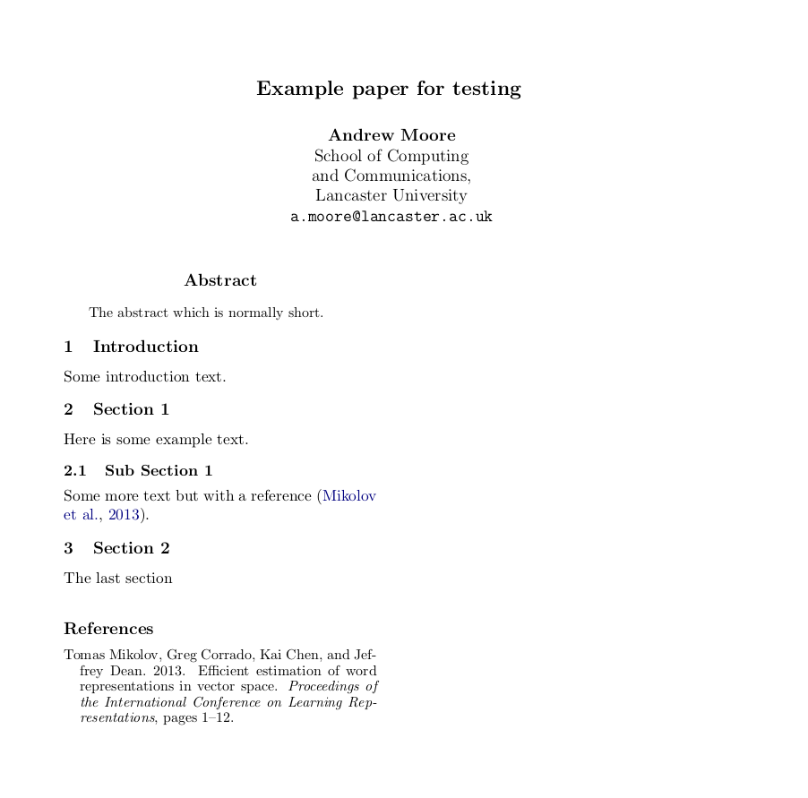

# Science Parse Python API
> A Python API for the <a href='https://github.com/allenai/science-parse'>Science Parse server</a>.


<p align="center">
    <a href="https://github.com/UCREL/science_parse_py_api/actions/workflows/main.yml"> </a>    
    <a href="https://codecov.io/gh/UCREL/science_parse_py_api"> </a>
    <a href="https://github.com/UCREL/science_parse_py_api/blob/master/LICENSE"> </a>
</p>

<p align="center">
    <a href="https://pypi.org/project/science_parse_api/">  </a>
    <a href="https://pypi.org/project/science_parse_api/">  </a>
</p>

## Install

`pip install science_parse_api`

## Requirements

This also requires that you have a science parse server running. This can be done through docker:

```
docker run -p 127.0.0.1:8080:8080 --rm ucrel/ucrel-science-parse:3.0.1
```

For versions of Science Parse < 3.0.1 see the [AllenAI docker hub](https://hub.docker.com/r/allenai/scienceparse).

If you would like to run the docker image with less memory (default is 8GB) then the following command will run it with a limit of 6GB:

```
docker run -p 127.0.0.1:8080:8080 --rm --memory=6g --memory-swap=6g --env JAVA_MEMORY=5 ucrel/ucrel-science-parse:3.0.1
```

For more details on this docker image see the [UCREL docker hub page](https://hub.docker.com/r/ucrel/ucrel-science-parse).

**Note** from the [science parse GitHub](https://github.com/allenai/science-parse/tree/master/cli#memory) it is recomended to run the science parse server with 6GB of memory for the Java process e.g. `JAVA_MEMORY=6`

## How to use

The API has only one main function: `parse_pdf`. 

It takes an input the:
1. **server_address** -- Address to the science parse server e.g. "http://127.0.0.1"
2. **file_path_to_pdf** -- The file path to the PDF you would like to parse.
3. **port** -- Port of the science parse server e.g. "8080" 

It will then return the parsed PDF as a Python dictionary with the following keys:

```python
['abstractText', 'authors', 'id', 'references', 'sections', 'title', 'year']
```

**Note** not all of these dictionary keys will always exist if science parse cannot detect the relevant information e.g. if it cannot find any references then there will be no reference key.

## Example

The example below shows how to use the `pdf_parse` function and the expected output format. In this example we ran the science parse server using docker e.g.:

```
docker run -p 127.0.0.1:8080:8080 --rm ucrel/ucrel-science-parse:3.0.1
```

```python
from pathlib import Path
import tempfile

from IPython.display import Image
import requests

from science_parse_api.test_helper import test_data_dir

try:
    # Tries to find the folder `test_data`
    test_data_directory = test_data_dir()
    test_pdf_paper = Path(test_data_directory, 
                      'example_for_test.pdf').resolve()
    image_file_name = str(Path(test_data_directory, 
                               'example_test_pdf_as_png.png'))
except FileNotFoundError:
    # If it cannot find that folder will get the pdf and 
    # image from Github. This will occur if you are using 
    # Google Colab
    pdf_url = ('https://github.com/UCREL/science_parse_py_api/'
               'raw/master/test_data/example_for_test.pdf')
    temp_test_pdf_paper = tempfile.NamedTemporaryFile('rb+')
    test_pdf_paper = Path(temp_test_pdf_paper.name)
    with test_pdf_paper.open('rb+') as test_fp:
        test_fp.write(requests.get(pdf_url).content)
        
    image_url = ('https://github.com/UCREL/science_parse_py_api'
                 '/raw/master/test_data/example_test_pdf_as_png.png')
    image_file = tempfile.NamedTemporaryFile('rb+', suffix='.png')
    with Path(image_file.name).open('rb+') as image_fp:
        image_fp.write(requests.get(image_url).content)
    image_file_name = image_file.name
    

Image(filename=image_file_name)
```





```python
import pprint
from science_parse_api.api import parse_pdf

host = 'http://127.0.0.1'
port = '8080'
output_dict = parse_pdf(host, test_pdf_paper, port=port)

pp = pprint.PrettyPrinter(indent=4)
pp.pprint(output_dict)
```

    {   'abstractText': 'The abstract which is normally short.',
        'authors': [{'affiliations': [], 'name': 'Andrew Moore'}],
        'id': 'SP:045daa3afe8335ca973de6dbed366626376434da',
        'references': [   {   'authors': [   'Tomas Mikolov',
                                             'Greg Corrado',
                                             'Kai Chen',
                                             'Jeffrey Dean.'],
                              'title': 'Efficient estimation of word '
                                       'representations in vector space',
                              'venue': 'Proceedings of the International '
                                       'Conference on Learning Representations, '
                                       'pages 1–12.',
                              'year': 2013}],
        'sections': [   {   'text': 'The abstract which is normally short.\n'
                                    '1 Introduction\n'
                                    'Some introduction text.\n'
                                    '2 Section 1\n'
                                    'Here is some example text.'},
                        {   'heading': '2.1 Sub Section 1',
                            'text': 'Some more text but with a reference (Mikolov '
                                    'et al., 2013).\n'
                                    '3 Section 2\n'
                                    'The last section\n'
                                    'References\n'
                                    'Tomas Mikolov, Greg Corrado, Kai Chen, and '
                                    'Jeffrey Dean. 2013. Efficient estimation of '
                                    'word representations in vector space. '
                                    'Proceedings of the International Conference '
                                    'on Learning Representations, pages 1–12.'}],
        'title': 'Example paper for testing',
        'year': 2021}


The output is not perfect but it is very good! Some of the things it did not pick up on:

1. The `authors` key never seems to get the affiliations of the authors (I have tried a few papers).
2. The sections are a list of sections and each section is made up of `text` and `heading`. However as this example shows it appears that these keys are not always guaranteed e.g. the first section only contains a `text` key.
3. The sections in this example does not contain all of the sections.
4. The last section also contains the References.
5. The output of the `authors` from `references` contains all of the correct authors. However one small issue is that `Jeffrey Dean` has a full stop at the end e.g. `Jeffrey Dean.`

Some of the really nice features:

1. Creates a unique `id` key based on hashing the request to the Science Parse server thus each request to the server will create a unique `id`.
2. The `year` key contains a python `int` e.g. `2021` and `2013`. 

## Uses of Science Parse

Science Parse has been used in the following academic papers:

1. [S2ORC: The Semantic Scholar Open Research Corpus](https://www.aclweb.org/anthology/2020.acl-main.447.pdf). They used Science Parse to extract title and authors from the PDF of academic papers. They then used [Grobid](https://grobid.readthedocs.io/en/latest/) to extract the rest of the data from the PDFs.

## Development

If you would like to develop on this library. Clone the repository and then install the regular requirements and the development requirements using:

``` bash
pip install -e .[dev]
```

[The `-e` is an editable flag](http://codumentary.blogspot.com/2014/11/python-tip-of-year-pip-install-editable.html) meaning that if you change anything in the library locally Python will keep track on those changes.

### Package is created with nbdev

**Note** as it is created with nbdev the code and documentation is generated from the notebooks that are within the [./module_notebooks folder](./module_notebooks).

**Note** need to run the following once: `nbdev_install_git_hooks`: ["This will set up git hooks which will remove metadata from your notebooks when you commit, greatly reducing the chance you have a conflict."](https://nbdev.fast.ai/tutorial.html#Install-git-hooks-to-avoid-and-handle-conflicts)

The main workflow is the following:

1. Edit the notebook(s) you want within [./module_notebooks folder.](./module_notebooks) **The README is generated from the [./module_notebooks/index.ipynb file.](./module_notebooks/index.ipynb)**
2. Run `nbdev_build_lib` to convert the notebook(s) into a Python module, which in this case will go into the [./science_parse_api folder](./science_parse_api). **Note** if you created a function in one python module and want to use it in another module then you will need to run `nbdev_build_lib` first, as that python module code needs to be transfered from the [./module_notebooks folder.](./module_notebooks) into the [./science_parse_api folder](./science_parse_api).
3. Create the documentation using `nbdev_build_docs`.
4. **Optionally** if you created tests run them using `make test`. When you do add tests in the notebooks you will need to import the function from the module and not rely on the function already expressed in the notebook, this is to ensure that code coverage is calculated correctly.
5. **Optionally** if you would like to see the documentation locally see the [sub-section below.](#local-documentation)
6. Git add the relevant notebook(s), python module code, and documentation.

### Local documentation

The documentation can be ran locally via a docker container. The easiest way to run this container is through the make command:

``` bash
make docker_docs_serve
```

**NOTE** This documentation does not update automatically, so it requires re-running this make command each time you want to see an updated version of the documentation.

### PYPI Package release

To release an updated version of the package:

1. Change the version number in [./settings.ini](./settings.ini)
2. Build the library using `nbdev_build_lib`
3. Then make the package and upload it to PYPI using `make release`

## Acknowledgement

The work has been funded by the [UCREL research centre at Lancaster University](http://ucrel.lancs.ac.uk/).

We would like to thank the AllenAI institute for creating the [Science Parse software.](https://github.com/allenai/science-parse)
